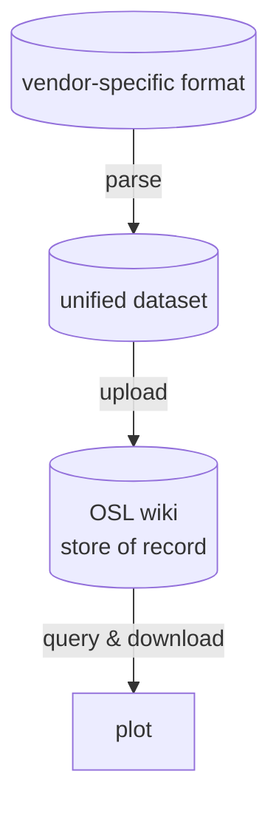
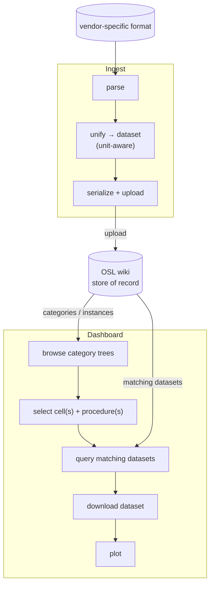
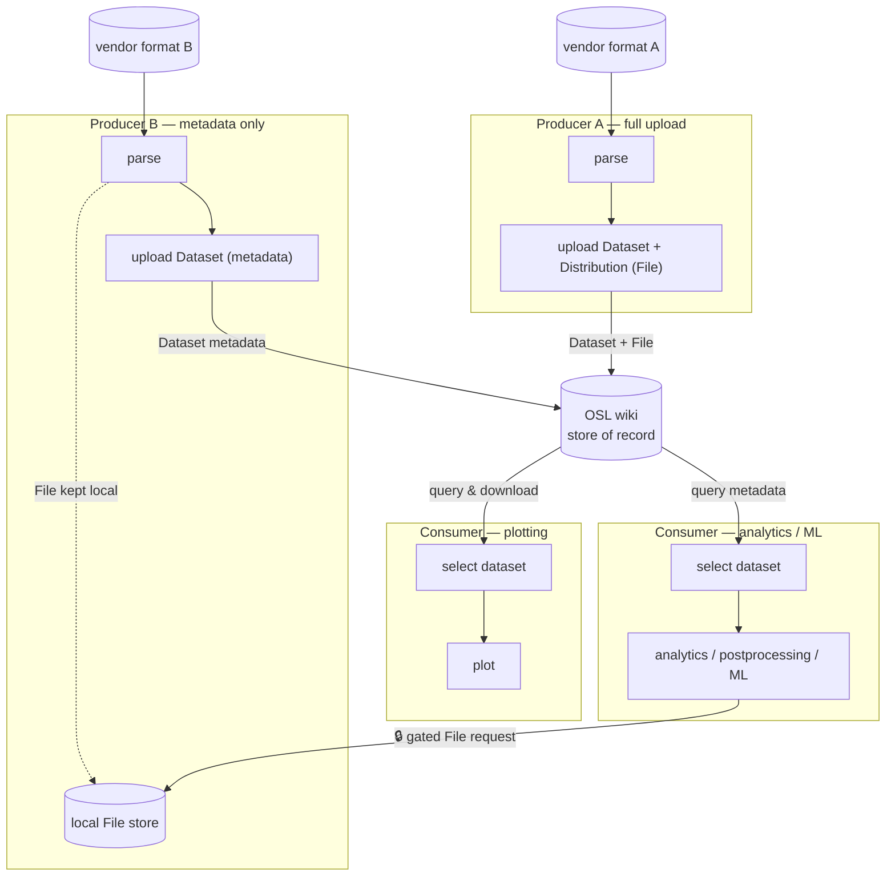

[](https://pypi.org/project/opensemantic.batteries/)
[](https://coveralls.io/r/OpenSemanticWorld-Packages/opensemantic.batteries)

# opensemantic.batteries

> Battery-domain Python models derived from the page package
> `world.opensemantic.batteries`, plus a typed, unit-aware battery cycling data
> model with cycler-file importers.

The package has two parts:

1. **Metadata models** - auto-generated Pydantic models (v1 and v2) for the
   battery domain: cells, modules and packs, cell formats and chemistries,
   electrode and electrolyte materials, electrochemical and mechanical tests,
   test procedures, and battery testing devices.
2. **Cycling data model** - the OSW-generated `ElectrochemicalCyclingDataset` /
   `CyclingDataRow`, with `dataset_to_df` / `dataset_from_df` pandas / pint
   round-trip helpers and importers for real cycler export files (Maccor).

Builds on
[opensemantic.core](https://github.com/OpenSemanticWorld-Packages/opensemantic.core-python),
[opensemantic.base](https://github.com/OpenSemanticWorld-Packages/opensemantic.base-python),
[opensemantic.lab](https://github.com/OpenSemanticWorld-Packages/opensemantic.lab-python)
and
[opensemantic.characteristics.quantitative](https://github.com/OpenSemanticWorld-Packages/opensemantic.characteristics.quantitative-python).

## Data flow

Vendor cycler exports are parsed into a unified, unit-aware dataset, uploaded to
an OSL wiki (the shared store of record), then browsed, queried, downloaded and
plotted through the dashboard. The OSL wiki sits at the centre: ingestion
**writes** to it, the viewer **reads** from it.



### Detailed flow



### Multiple Users



Stage status today: **parse** and **unify** and the read-side
**browse → query → download → plot** path are implemented; the **upload** step
(serialising the dataset and writing it to the wiki) is not yet wired in the
library — the viewer currently reads pages that were uploaded out of band.

## Installation

```bash
pip install opensemantic.batteries              # metadata models only
pip install opensemantic.batteries[maccor]      # + Maccor cycler-file import
pip install opensemantic.batteries[controller]  # + controller extras (via opensemantic.lab)
pip install opensemantic.batteries[view]        # + dashboard view extras (via opensemantic.lab)
```

## Metadata models

The generated models mirror the OSW schema classes. Every model is an
`OswBaseModel`, so it carries an OSW identity (`uuid`, `type`) and can produce
its IRI - a *type* (e.g. `BatteryCellType`) resolves to a `Category:` IRI, a
concrete instance (e.g. `BatteryCell`) to an `Item:` IRI:

```python
import opensemantic.batteries as batteries        # Pydantic v2 models
import opensemantic.batteries.v1 as batteries_v1   # Pydantic v1 models

# A cell *type* (a Category) links a chemistry, form factor and format.
# "range" fields accept the linked object directly.
cell_type = batteries.BatteryCellType(
    label=[{"text": "18650 NMC"}],
    battery_chemistry=batteries.BatteryChemistry(
        label=[{"text": "Lithium-ion (NMC)"}]
    ),
    cell_form_factor=batteries.BatteryCellFormFactor(
        label=[{"text": "Cylindrical"}]
    ),
    cell_format=batteries.BatteryCellFormat(label=[{"text": "18650"}]),
)
cell_type.get_iri()                      # 'Category:OSW...'  (a type -> Category)
cell_type.battery_chemistry.get_iri()    # 'Item:OSW...'

# A concrete cell (an Item) with its electrode / electrolyte parts.
cell = batteries.BatteryCell(
    label=[{"text": "My 18650 cell #1"}],
    positive_electrode=batteries.Electrode(label=[{"text": "NMC cathode"}]),
    negative_electrode=batteries.Electrode(label=[{"text": "Graphite anode"}]),
    electrolyte=batteries.Electrolyte(label=[{"text": "LiPF6 in EC:DMC"}]),
)
cell.get_iri()                           # 'Item:OSW...'
cell.positive_electrode.get_iri()        # 'Item:OSW...'

# Linked ("range") fields serialise as IRI references:
cell_type.to_json()["battery_chemistry"]  # 'Item:OSW...'
```

`BatteryCellType` also exposes `positive_electrode` / `negative_electrode` /
`reference_electrode` / `electrolyte` / `separator` as electrode/material *type*
references (IRI strings), while `BatteryCell` carries the concrete `Electrode`,
`Electrolyte` and `Separator` parts.

### Available classes

Cells, modules and packs:
`BatteryCell`, `BatteryCellType`, `BatteryModule`, `BatteryPack`,
`BatteryModuleWithSensors`, `ElectrochemicalCell`,
`ElectrochemicalEnergyStorageDevice`, `EESD`, `EESDType`.

Formats and form factors:
`BatteryFormat`, `BatteryCellFormat`, `BatteryCellFormatType`,
`CoinCellFormat`, `CylindricalCellFormat`, `PouchCellFormat`,
`PrismaticCellFormat`, `SwagelockCellFormat`, `FormFactor`,
`BatteryCellFormFactor`.

Chemistry and materials:
`BatteryChemistry`, `ChemicalSystem`, `BatteryCellMaterial`,
`BatteryElectrodeMaterial`, `BatteryElectrolyteMaterial`, `Electrolyte`,
`ElectrolyteAdditive`, `Electrode`, `BatteryElectrodeType`, `CurrentCollector`,
`Separator`.

Tests, procedures and devices:
`ElectrochemicalTest`, `ElectrochemicalTestProcedure`, `BatteryTestProcedure`,
`BatteryStatePreparationTestProcedure`, `FormationTestProcedure`,
`PostMortemExperiment`, `BatteryCellOpening`, `BatteryCycler`,
`ElectrochemicalTestingDevice`.

(See `src/opensemantic/batteries/_model.py` for the full set of ~95 classes,
including the shared base and enumeration types.)

## Cycling data model

`ElectrochemicalCyclingDataset` holds its rows in `.data`, an ordered list of
`CyclingDataRow`. Each row field is a typed, unit-aware quantity, so the field
name stays unit-agnostic and the unit lives in the value:

| field | quantity | default unit | notes |
|---|---|---|---|
| `test_time` | Time | second | required |
| `voltage` | Voltage | volt | required |
| `current` | Electric current | ampere | required |
| `cycle_count`, `step_count` | Dimensionless | dimensionless | optional |
| `step_time` | Time | second | optional |
| `capacity` | Electric charge | coulomb | optional |
| `energy` | Energy | joule | optional |

> **Note.** `ElectrochemicalCyclingDataset` / `CyclingDataRow` are OSW-generated
> models, currently re-exported from `osw.model.entity` (they will move into the
> package's generated `_model.py`). A `label` is required on the dataset.

```python
from opensemantic.batteries import ElectrochemicalCyclingDataset, CyclingDataRow
from opensemantic.core.v1 import Label

ds = ElectrochemicalCyclingDataset(
    label=[Label(text="example")],
    data=[
        CyclingDataRow(
            test_time={"value": 0.0},
            voltage={"value": 3.0},
            current={"value": 0.0},
        ),
        CyclingDataRow(
            test_time={"value": 1.0},
            voltage={"value": 3.1},
            current={"value": 0.5},
        ),
    ],
)
```

### Importing cycler files

`read_maccor` parses a Maccor text / MIMS export into an
`ElectrochemicalCyclingDataset` (labelled with the source file name; requires the
`[maccor]` extra). The five formats produced by
[maccor-utility](https://github.com/OpenBattTools/maccor-utility) are supported
and detected from the file name; pass `fmt=` to override:

```python
from opensemantic.batteries import read_maccor

ds = read_maccor("cell_export2.024.txt")          # format detected from the name
ds = read_maccor("data.txt", fmt="maccor_export2")  # or set it explicitly
len(ds.data)
```

Supported formats: `maccor_export1`, `maccor_export2`, `mims_client1`,
`mims_client2`, `mims_server2`. To add another cycler, subclass `CyclerImporter`
and implement `to_dataframe()`.

### DataFrames (pandas + pint)

`dataset_to_df(ds)` yields a [pint-pandas](https://github.com/hgrecco/pint-pandas)
DataFrame (one column per field, unit carried by the dtype).
`dataset_from_df(df, label=...)` is the inverse; it maps columns to the fixed
`CyclingDataRow` schema (converting each to the field's default unit) and
**ignores** any extra column:

```python
from opensemantic.batteries import dataset_to_df, dataset_from_df

df = dataset_to_df(ds)
df["voltage"].dtype                       # pint[volt][Float64]

# unit-aware math on the frame; 'power' is not a row field, so it stays on the
# DataFrame only (dataset_from_df drops it)
df["power"] = df["voltage"] * df["current"]

enriched = dataset_from_df(df, label="derived")
```

### Serialisation

Compact JSON round-trip - `exclude_defaults` drops values left at their default
unit/type, leaving just the number, and the canonical units are restored on load:

```python
payload = enriched.to_json(exclude_defaults=True)
payload["data"][1]["voltage"]             # {'value': 3.1}

restored = ElectrochemicalCyclingDataset.from_json(payload)
restored.data[1].voltage.unit.name        # 'volt'
```

Unit-aware CSV - pint-pandas `dequantify()` writes a dedicated unit header line,
keeping the column keys unit-free:

```python
print(dataset_to_df(enriched).pint.dequantify().to_csv())
# ,test_time,voltage,current,...
# unit,second,volt,ampere,...
# 0,0.0,3.0,0.0,...
```

A runnable end-to-end example (import a Maccor file, derive a column, serialise,
re-import, export CSV) is in
[`examples/import_maccor.py`](examples/import_maccor.py).

## Dashboard (view)

`opensemantic.batteries.view` provides an interactive Panel/Bokeh dashboard,
`BatteryDataView`, for plotting cycling data, plus `OOLDTreeBuilder` for driving
its cell / procedure trees straight from Python objects. Units are switched via
the characteristics' own pint-backed `.to_unit()` (no hard-coded factor tables).

The sidebar has an **Instances** card that live-lists the test runs matching the
current cell + procedure selection; each has a checkbox so you can pick exactly
which datasets are plotted.

Plots live in a single ordered stack. Exactly one plot is **active** — the one
the sidebar selection drives — and it shows a blue **❄ Freeze plot** button;
every other plot is a frozen snapshot showing an **Unfreeze** button. Each
plot's full state is a `PlotState` (Pydantic) — the selected cells, procedures,
per-instance toggles, axis assignment and unit choices. **Freezing** drops a
static snapshot (that `PlotState` + the figure) directly below the active plot,
which stays put and keeps tracking the sidebar, so you can compare
configurations. **Unfreezing** a snapshot swaps roles *in place* — nothing is
reordered: the clicked plot becomes active where it sits (its button turns into
the blue Freeze) and its saved `PlotState` is restored into every tab (including
the tree checkboxes), while the previously-active plot freezes where it sits (its
button turns into Unfreeze). Every plot also has a **Delete** button: deleting a
frozen plot removes that snapshot; deleting the active plot promotes a neighbour
(or leaves a fresh empty plot if it was the last one).

```bash
pip install opensemantic.batteries[view]
panel serve examples/battery_dashboard.py --dev
```

```python
from opensemantic.batteries.view import BatteryDataView, OOLDTreeBuilder, PythonSource, has_type
```

See [`src/opensemantic/batteries/view/README.md`](src/opensemantic/batteries/view/README.md)
for the architecture (it extends `BaseDataView` from `opensemantic.base.view`),
the unit-conversion design, and the v1/v2 layer pitfall. Runnable examples:
[`examples/battery_dashboard.py`](examples/battery_dashboard.py) and
[`examples/battery_tree_example.py`](examples/battery_tree_example.py).

## Note

The models in `src/opensemantic/batteries/_model.py` and
`src/opensemantic/batteries/v1/_model.py` are generated by the
[osw-python-package-generator](https://github.com/OpenSemanticWorld-Packages/osw-python-package-generator)
from the `world.opensemantic.batteries` schema package. Do not edit them
manually. The cycling data helpers (`_cycling.py`) and importers (`_importers/`)
are hand-written around those generated classes.
